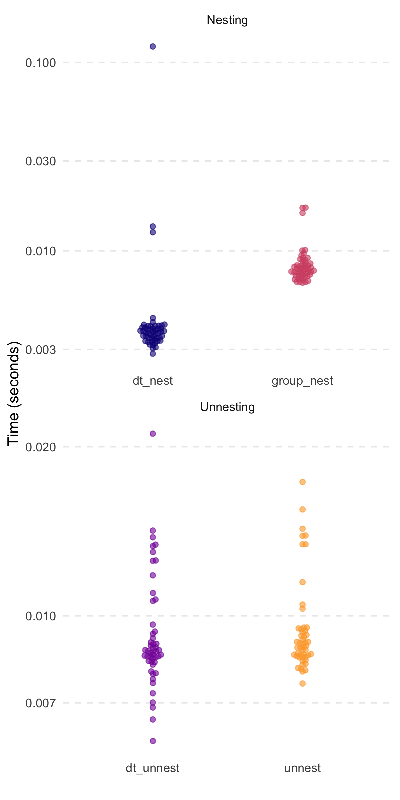

<!-- README.md is generated from README.Rmd. Please edit that file -->

# `tidyfast v0.1.1` 

<!-- badges: start -->

<!-- badges: end -->

The goal of `tidyfast` is to provide fast and efficient alternatives to
some `tidyr` and `dplyr` functions using `data.table` under the hood.
Each have the prefix of `dt_` to allow for autocomplete in IDEs such as
RStudio. These should compliment some of the current functionality in
`dtplyr` (but notably does not use the `lazy_dt()` framework of
`dtplyr`).

The current functions include:

**Nesting and unnesting** (similar to `tidyr::nest()` or
`dplyr::group_nest()` and `tidyr::unnest()`):

  - `dt_nest()` for nesting data tables
  - `dt_unnest()` for unnesting data tables
  - `dt_unnest_vec()` for unnesting vectors in a list-column in a data
    table

**If Else** (similar to `dplyr::case_when()`):

  - `dt_case_when()` for `dplyr::case_when()` syntax with the speed of
    `data.table::fifelse()`

Package is still in active development.

## Installation

You can install the development version from
[GitHub](https://github.com/) with:

``` r
# install.packages("devtools")
devtools::install_github("TysonStanley/tidyfast")
```

## Example

The nesting and unnesting functions were shown in a [previous
preprint](https://psyarxiv.com/u8ekc/) while `dt_case_when()` is really
new. Herein, I show more simple applications.

The following data table will be used for the examples.

``` r
library(tidyfast)
library(data.table)
library(dplyr)       # to compare with case_when()

dt <- data.table(
   x = rnorm(1e5),
   y = runif(1e5),
   grp = sample(1L:3L, 1e5, replace = TRUE),
   nested1 = lapply(1:10, sample, 10, replace = TRUE),
   nested2 = lapply(c("thing1", "thing2"), sample, 10, replace = TRUE),
   id = 1:1e5)
```

### Nesting and Unnesting

We can nest this data using `dt_nest()`:

``` r
nested <- dt_nest(dt, grp)
nested
#>    grp         data
#> 1:   1 <data.table>
#> 2:   3 <data.table>
#> 3:   2 <data.table>
```

We can also unnest this with `dt_unnest()`:

``` r
dt_unnest(nested, col = data, id = grp)
#>         grp           x         y         nested1
#>      1:   1  1.74430355 0.1236198 1,1,1,1,1,1,...
#>      2:   1 -1.22134546 0.1930840 2,1,2,2,2,2,...
#>      3:   1 -0.74284192 0.1967749 1,2,1,1,3,3,...
#>      4:   1 -2.41169525 0.7422440 4,4,3,1,3,4,...
#>      5:   1 -0.59810376 0.1565031 6,5,1,5,3,6,...
#>     ---                                          
#>  99996:   2  1.14510593 0.9404775 2,3,6,6,3,4,...
#>  99997:   2  0.04006474 0.8370938 2,1,2,2,2,2,...
#>  99998:   2  1.21159489 0.6585533 5,3,2,1,1,1,...
#>  99999:   2 -0.41479408 0.4716028 2,3,6,6,3,4,...
#> 100000:   2  0.31899842 0.9813373 3,7,4,4,5,3,...
#>                                               nested2    id
#>      1: thing1,thing1,thing1,thing1,thing1,thing1,...     1
#>      2: thing2,thing2,thing2,thing2,thing2,thing2,...     2
#>      3: thing1,thing1,thing1,thing1,thing1,thing1,...     3
#>      4: thing2,thing2,thing2,thing2,thing2,thing2,...     4
#>      5: thing2,thing2,thing2,thing2,thing2,thing2,...     6
#>     ---                                                    
#>  99996: thing2,thing2,thing2,thing2,thing2,thing2,... 99988
#>  99997: thing2,thing2,thing2,thing2,thing2,thing2,... 99992
#>  99998: thing1,thing1,thing1,thing1,thing1,thing1,... 99995
#>  99999: thing2,thing2,thing2,thing2,thing2,thing2,... 99998
#> 100000: thing1,thing1,thing1,thing1,thing1,thing1,... 99999
```

When our list columns don’t have data tables (as output from
`dt_nest()`) we can use the `dt_unnest_vec()` function, that will unnest
vectors.

``` r
dt_unnest_vec(dt, 
              cols = list(nested1, nested2), 
              id = id, 
              name = c("nested1", "nested2"))
#>              id nested1 nested2
#>       1:      1       1  thing1
#>       2:      1       1  thing1
#>       3:      1       1  thing1
#>       4:      1       1  thing1
#>       5:      1       1  thing1
#>      ---                       
#>  999996: 100000       8  thing2
#>  999997: 100000       7  thing2
#>  999998: 100000       8  thing2
#>  999999: 100000       6  thing2
#> 1000000: 100000       7  thing2
```

### If Else

Also, the new `dt_case_when()` function is built on the very fast
`data.table::fiflese()` but has syntax like unto `dplyr::case_when()`.
That is, it looks like:

``` r
dt_case_when(condition1 ~ label1,
             condition2 ~ label2,
             ...)
```

To show that each method, `dt_case_when()`, `dplyr::case_when()`, and
`data.table::fifelse()` produce the same result, consider the following
example.

``` r
x <- rnorm(1e6)

medianx <- median(x)
x_cat <-
  dt_case_when(x < medianx ~ "low",
               x >= medianx ~ "high",
               is.na(x) ~ "unknown")
x_cat_dplyr <-
  case_when(x < medianx ~ "low",
            x >= medianx ~ "high",
            is.na(x) ~ "unknown")
x_cat_fif <-
  fifelse(x < medianx, "low",
  fifelse(x >= medianx, "high",
  fifelse(is.na(x), "unknown", NA_character_)))

identical(x_cat, x_cat_dplyr)
#> [1] TRUE
identical(x_cat, x_cat_fif)
#> [1] TRUE
```

Notably, `dt_case_when()` is very fast and memory efficient, given it is
built on `data.table::fifelse()`.



    #> # A tibble: 3 x 3
    #>   expression     median mem_alloc
    #>   <chr>        <bch:tm> <bch:byt>
    #> 1 case_when     123.7ms   148.8MB
    #> 2 dt_case_when   34.9ms    34.3MB
    #> 3 fifelse        33.4ms    34.3MB

## Note

Please note that the `tidyfast` project is released with a [Contributor
Code of Conduct](.github/CODE_OF_CONDUCT.md). By contributing to this
project, you agree to abide by its terms.

Also, `ggplot2`, `ggbeeswarm`, and `tidyr` were used herein for creating
the plot.
