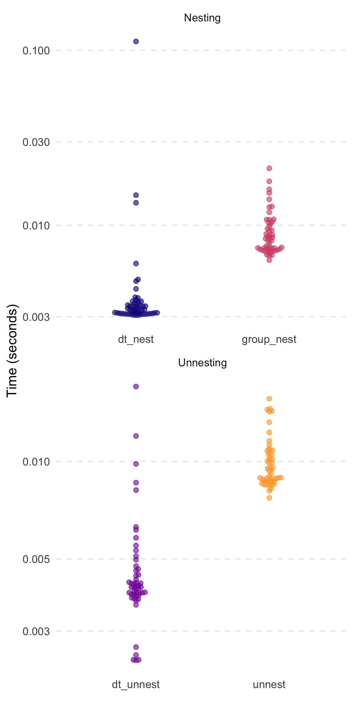
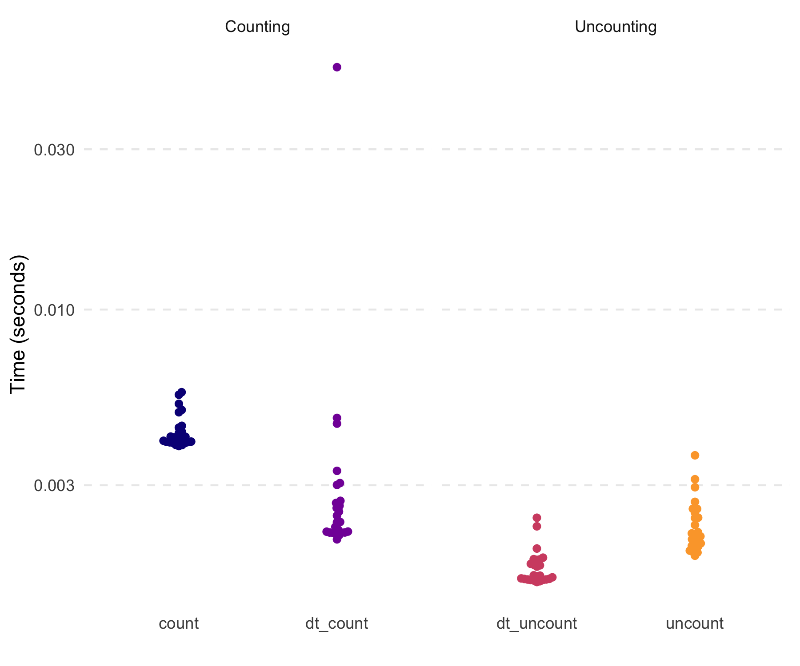

<!-- README.md is generated from README.Rmd. Please edit that file -->

# `tidyfast v0.2.0` 

<!-- badges: start -->

[](https://www.tidyverse.org/lifecycle/#maturing)
[](https://travis-ci.org/TysonStanley/tidyfast)
[](https://codecov.io/gh/TysonStanley/tidyfast?branch=master)
<!-- badges: end -->

The goal of `tidyfast` is to provide fast and efficient alternatives to
some `tidyr` (and a few `dplyr`) functions using `data.table` under the
hood. Each have the prefix of `dt_` to allow for autocomplete in IDEs
such as RStudio. These should compliment some of the current
functionality in `dtplyr` (but notably does not use the `lazy_dt()`
framework of `dtplyr`). This package imports `data.table` and `Rcpp` (no
other dependencies).

These are, in essence, translations from a more `tidyverse` grammar to
`data.table`. Most functions herein are in places where, in my opinion,
the `data.table` syntax is not obvious or clear. As such, these
functions can translate a simple function call into the fast, efficient,
and concise syntax of `data.table`.

The current functions include:

**Nesting and unnesting** (similar to `dplyr::group_nest()` and
`tidyr::unnest()`):

  - `dt_nest()` for nesting data tables
  - `dt_unnest()` for unnesting data tables
  - `dt_hoist()` for unnesting vectors in a list-column in a data table

**If Else** (similar to `dplyr::case_when()`):

  - `dt_case_when()` for `dplyr::case_when()` syntax with the speed of
    `data.table::fifelse()`

**Fill** (similar to `tidyr::fill()`)

  - `dt_fill()` for filling `NA` values with values before it, after it,
    or both. This can be done by a grouping variable (e.g. fill in `NA`
    values with values within an individual).

**Count** and **Uncount** (similar to `tidyr::uncount()` and
`dplyr::count()`)

  - `dt_count()` for fast counting by group(s)
  - `dt_uncount()` for creating full data from a count table

**Separate** (similar to `tidyr::separate()`)

  - `dt_separate()` for splitting a single column into multiple based on
    a match within the column (e.g., column with values like “A.B” could
    be split into two columns by using the period as the separator where
    column 1 would have “A” and 2 would have “B”). It is built on
    `data.table::tstrsplit()`. This is not well tested yet and lacks
    some functionality of `tidyr::separate()`.

**Pivoting** (similar to `tidyr::pivot_longer()` and
`tidyr::pivot_wider()`)

  - `dt_pivot_longer()` for fast pivoting using `data.table::melt()`
  - `dt_pivot_wider()` for fast pivoting using `data.table::dcast()`

**Adjust `data.table` print options**

  - `dt_print_options()` for adjusting the options for
    `print.data.table()`

## General API

`tidyfast` attempts to convert syntax from `tidyr` with its accompanying
grammar to `data.table` function calls. As such, we have tried to
maintain the `tidyr` syntax as closely as possible without hurting speed
and efficiency. Some more advanced use cases in `tidyr` may not
translate yet. We try to be transparent about the shortcomings in syntax
and behavior where known.

Each function that takes data (labeled as `dt_` in the package docs) as
its first argument automatically coerces it to a data table with
`as.data.table()` if it isn’t already a data table. These will return a
data table.

## Installation

You can install the development version from
[GitHub](https://github.com/) with:

``` r
# install.packages("remotes")
remotes::install_github("TysonStanley/tidyfast")
```

## Examples

The initial versions of the nesting and unnesting functions were shown
in a [preprint](https://psyarxiv.com/u8ekc/). Herein is shown some
simple applications and the functions’ speed/efficiency.

### Nesting and Unnesting

The following data table will be used for the nesting/unnesting
examples.

``` r
set.seed(84322)

library(tidyfast)
library(data.table)
library(dplyr)       # to compare with case_when()
library(tidyr)       # to compare with fill() and separate()
library(ggplot2)     # figures
library(ggbeeswarm)  # figures

dt <- data.table(
   x = rnorm(1e5),
   y = runif(1e5),
   grp = sample(1L:5L, 1e5, replace = TRUE),
   nested1 = lapply(1:10, sample, 10, replace = TRUE),
   nested2 = lapply(c("thing1", "thing2"), sample, 10, replace = TRUE),
   id = 1:1e5)
```

To make all the comparisons herein more equal, we will set the number of
threads that `data.table` will use to 1.

``` r
setDTthreads(1)
```

We can nest this data using `dt_nest()`:

``` r
nested <- dt_nest(dt, grp)
nested
#>    grp         data
#> 1:   1 <data.table>
#> 2:   2 <data.table>
#> 3:   3 <data.table>
#> 4:   4 <data.table>
#> 5:   5 <data.table>
```

We can also unnest this with `dt_unnest()`:

``` r
dt_unnest(nested, col = data)
#>         grp          x           y               nested1
#>      1:   1 -1.1813164 0.004599736       2,2,1,2,1,1,...
#>      2:   1 -1.0384420 0.853208540       2,8,4,6,7,7,...
#>      3:   1 -0.6247028 0.072652533       4,2,2,1,1,1,...
#>      4:   1 -1.3651514 0.569079215       1,1,1,3,6,2,...
#>      5:   1  0.1403744 0.864617284 10, 1, 1, 1, 8, 1,...
#>     ---                                                 
#>  99996:   5 -0.3437795 0.995197776       2,1,2,2,2,1,...
#>  99997:   5  1.6157744 0.241735719 10, 1, 1, 1, 8, 1,...
#>  99998:   5 -0.1321246 0.885283934       2,3,3,2,2,4,...
#>  99999:   5 -1.7019715 0.524621296       5,4,3,3,3,2,...
#> 100000:   5  0.3821493 0.032851280       2,8,4,6,7,7,...
#>                                               nested2    id
#>      1: thing2,thing2,thing2,thing2,thing2,thing2,...     2
#>      2: thing2,thing2,thing2,thing2,thing2,thing2,...     8
#>      3: thing1,thing1,thing1,thing1,thing1,thing1,...    15
#>      4: thing1,thing1,thing1,thing1,thing1,thing1,...    17
#>      5: thing2,thing2,thing2,thing2,thing2,thing2,...    20
#>     ---                                                    
#>  99996: thing1,thing1,thing1,thing1,thing1,thing1,... 99983
#>  99997: thing2,thing2,thing2,thing2,thing2,thing2,... 99990
#>  99998: thing2,thing2,thing2,thing2,thing2,thing2,... 99994
#>  99999: thing2,thing2,thing2,thing2,thing2,thing2,... 99996
#> 100000: thing2,thing2,thing2,thing2,thing2,thing2,... 99998
```

When our list columns don’t have data tables (as output from
`dt_nest()`) we can use the `dt_hoist()` function, that will unnest
vectors. It keeps all the other variables that are not list-columns as
well.

``` r
dt_hoist(dt, nested1, nested2)
#> The following columns were dropped because they are list-columns (but not being hoisted): nested1, nested2
#>                  x         y grp     id nested1 nested2
#>       1: 0.1720703 0.3376675   2      1       1  thing1
#>       2: 0.1720703 0.3376675   2      1       1  thing1
#>       3: 0.1720703 0.3376675   2      1       1  thing1
#>       4: 0.1720703 0.3376675   2      1       1  thing1
#>       5: 0.1720703 0.3376675   2      1       1  thing1
#>      ---                                               
#>  999996: 0.6268181 0.7851774   1 100000       1  thing2
#>  999997: 0.6268181 0.7851774   1 100000       5  thing2
#>  999998: 0.6268181 0.7851774   1 100000       7  thing2
#>  999999: 0.6268181 0.7851774   1 100000       6  thing2
#> 1000000: 0.6268181 0.7851774   1 100000       7  thing2
```

Speed comparisons (similar to those shown in the preprint) are
highlighted below. Notably, the timings are without the `nested1` and
`nested2` columns of the original `dt` object from above. Also, all
`dplyr` and `tidyr` functions use a `tbl` version of the `dt`
    table.

    #> The following columns were dropped because they are list-columns (but not being hoisted): result, memory, time, gc



    #> # A tibble: 2 x 3
    #>   expression   median mem_alloc
    #>   <chr>      <bch:tm> <bch:byt>
    #> 1 dt_nest      3.49ms    2.88MB
    #> 2 group_nest   5.21ms    2.54MB
    #> # A tibble: 2 x 3
    #>   expression   median mem_alloc
    #>   <chr>      <bch:tm> <bch:byt>
    #> 1 dt_unnest     5.3ms    6.22MB
    #> 2 unnest       13.1ms    8.47MB

### If Else

Also, the new `dt_case_when()` function is built on the very fast
`data.table::fiflese()` but has syntax like unto `dplyr::case_when()`.
That is, it looks like:

``` r
dt_case_when(condition1 ~ label1,
             condition2 ~ label2,
             ...)
```

To show that each method, `dt_case_when()`, `dplyr::case_when()`, and
`data.table::fifelse()` produce the same result, consider the following
example.

``` r
x <- rnorm(1e6)

medianx <- median(x)
x_cat <-
  dt_case_when(x < medianx ~ "low",
               x >= medianx ~ "high",
               is.na(x) ~ "unknown")
x_cat_dplyr <-
  case_when(x < medianx ~ "low",
            x >= medianx ~ "high",
            is.na(x) ~ "unknown")
x_cat_fif <-
  fifelse(x < medianx, "low",
  fifelse(x >= medianx, "high",
  fifelse(is.na(x), "unknown", NA_character_)))

identical(x_cat, x_cat_dplyr)
#> [1] TRUE
identical(x_cat, x_cat_fif)
#> [1] TRUE
```

Notably, `dt_case_when()` is very fast and memory efficient, given it is
built on `data.table::fifelse()`.


    #> # A tibble: 3 x 3
    #>   expression     median mem_alloc
    #>   <chr>        <bch:tm> <bch:byt>
    #> 1 case_when     135.1ms   148.8MB
    #> 2 dt_case_when   35.4ms    34.3MB
    #> 3 fifelse        37.4ms    34.3MB

## Fill

A new function is `dt_fill()`, which fulfills the role of
`tidyr::fill()` to fill in `NA` values with values around it (either the
value above, below, or trying both). This currently relies on the
efficient `C++` code from `tidyr` (`fillUp()` and `fillDown()`).

``` r
x = 1:10
dt_with_nas <- data.table(
  x = x,
  y = shift(x, 2L),
  z = shift(x, -2L),
  a = sample(c(rep(NA, 10), x), 10),
  id = sample(1:3, 10, replace = TRUE))

# Original
dt_with_nas
#>      x  y  z  a id
#>  1:  1 NA  3 NA  3
#>  2:  2 NA  4  9  3
#>  3:  3  1  5 NA  1
#>  4:  4  2  6  8  3
#>  5:  5  3  7 NA  2
#>  6:  6  4  8 NA  2
#>  7:  7  5  9  7  3
#>  8:  8  6 10 NA  2
#>  9:  9  7 NA NA  2
#> 10: 10  8 NA  4  2

# All defaults
dt_fill(dt_with_nas, y, z, a)
#>      y  z  a
#>  1: NA  3 NA
#>  2: NA  4  9
#>  3:  1  5  9
#>  4:  2  6  8
#>  5:  3  7  8
#>  6:  4  8  8
#>  7:  5  9  7
#>  8:  6 10  7
#>  9:  7 10  7
#> 10:  8 10  4

# by id variable called `grp`
dt_fill(dt_with_nas, 
        y, z, a, 
        id = list(id))
#>     id  y  z  a
#>  1:  3 NA  3 NA
#>  2:  3 NA  4  9
#>  3:  3  2  6  8
#>  4:  3  5  9  7
#>  5:  1  1  5 NA
#>  6:  2  3  7 NA
#>  7:  2  4  8 NA
#>  8:  2  6 10 NA
#>  9:  2  7 10 NA
#> 10:  2  8 10  4

# both down and then up filling by group
dt_fill(dt_with_nas, 
        y, z, a, 
        id = list(id), 
        .direction = "downup")
#>     id y  z  a
#>  1:  3 2  3  9
#>  2:  3 2  4  9
#>  3:  3 2  6  8
#>  4:  3 5  9  7
#>  5:  1 1  5 NA
#>  6:  2 3  7  4
#>  7:  2 4  8  4
#>  8:  2 6 10  4
#>  9:  2 7 10  4
#> 10:  2 8 10  4
```

In its current form, `dt_fill()` is faster than `tidyr::fill()` and uses
slightly less memory. Below are the results of filling in the `NA`s
within each `id` on a 19 MB data set.

``` r
x = 1:1e6
dt3 <- data.table(
  x = x,
  y = shift(x, 10L),
  z = shift(x, -10L),
  a = sample(c(rep(NA, 10), x), 10),
  id = sample(1:3, 10, replace = TRUE))
df3 <- data.frame(dt3)

marks3 <-
  bench::mark(
    tidyr::fill(dplyr::group_by(df3, id), x, y),
    tidyfast::dt_fill(dt3, x, y, id = list(id)),
    check = FALSE,
    iterations = 50
  )
```


    #> # A tibble: 2 x 3
    #>   expression                                    median mem_alloc
    #>   <bch:expr>                                  <bch:tm> <bch:byt>
    #> 1 tidyr::fill(dplyr::group_by(df3, id), x, y)   65.4ms    30.7MB
    #> 2 tidyfast::dt_fill(dt3, x, y, id = list(id))   21.8ms    29.1MB

## Separate

The `dt_separate()` function is still under heavy development. Its
behavior is similar to `tidyr::separate()` but is lacking some
functionality currently. For example, `into` needs to be supplied the
maximum number of possible columns to separate.

``` r
dt_separate(data.table(col = "A.B.C"), col, into = c("A", "B"))
#> Error in `[.data.table`(dt, , eval(split_it)) : 
#>   Supplied 2 columns to be assigned 3 items. Please see NEWS for v1.12.2.
```

For current functionality, consider the following example.

``` r
dt_to_split <- data.table(
  x = paste(letters, LETTERS, sep = ".")
)

dt_separate(dt_to_split, x, into = c("lower", "upper"))
```

    #>    lower upper
    #> 1:     a     A
    #> 2:     b     B
    #> 3:     c     C
    #> 4:     d     D
    #> 5:     e     E
    #> 6:     f     F

Testing with a 4 MB data set with one variable that has columns of “A.B”
repeatedly, shows that `dt_separate()` is fast but less memory efficient
than `tidyr::separate()`.


    #> # A tibble: 3 x 3
    #>   expression            median mem_alloc
    #>   <chr>               <bch:tm> <bch:byt>
    #> 1 separate               369ms    11.6MB
    #> 2 dt_separate            122ms    30.6MB
    #> 3 dt_separate-mutable    111ms    26.7MB

## Count and Uncount

The `dt_count()` function does essentially what `dplyr::count()` does.
Notably, this, unlike the majority of other `dt_` functions, wraps a
very simple statement in `data.table`. That is, `data.table` makes
getting counts very simple and concise. Nonetheless, `dt_count()` fits
the general API of `tidyfast`. To some degree, `dt_uncount()` is also a
fairly simple wrapper, although the approach may not be as
straightforward as that for `dt_count()`.

The following examples show how count and uncount can work. We’ll use
the `dt` data table from the nesting examples.

``` r
counted <- dt_count(dt, grp)
counted
#>    grp     N
#> 1:   1 19638
#> 2:   2 19987
#> 3:   3 20033
#> 4:   4 20269
#> 5:   5 20073
```

``` r
uncounted <- dt_uncount(counted, N)
print(uncounted)
#>         grp
#>      1:   1
#>      2:   1
#>      3:   1
#>      4:   1
#>      5:   1
#>     ---    
#>  99996:   5
#>  99997:   5
#>  99998:   5
#>  99999:   5
#> 100000:   5
```

These are also quick (not that the `tidyverse` functions were at all
slow here).

``` r
dt5 <- copy(dt)
df5 <- data.frame(dt5)

marks5 <-
  bench::mark(
    counted_tbl <- dplyr::count(df5, grp),
    counted_dt <- tidyfast::dt_count(dt5, grp),
    tidyr::uncount(counted_tbl, n),
    tidyfast::dt_uncount(counted_dt, N),
    check = FALSE,
    iterations = 25
  )
```


## Pivoting

Finally, thanks to \[@mtfairbanks\](<https://github.com/mtfairbanks>),
we now have pivoting translations to `data.table::melt()` and
`data.table::dcast()`. Consider the following example (similar to the
example in `tidyr::pivot_longer()` and `tidyr::pivot_wider()`):

``` r
billboard <- tidyr::billboard

# note the warning - melt is telling us what 
#   it did with the various data types---logical (where there were just NAs
#   and numeric
longer <- billboard %>%
 dt_pivot_longer(
   cols = c(-artist, -track, -date.entered),
   names_to = "week",
   names_prefix = "wk",
   values_to = "rank"
 )
#> Warning in melt.data.table(data = dt_, id.vars = id_vars, measure.vars =
#> cols, : 'measure.vars' [wk1, wk2, wk3, wk4, ...] are not all of the same
#> type. By order of hierarchy, the molten data value column will be of type
#> 'double'. All measure variables not of type 'double' will be coerced too.
#> Check DETAILS in ?melt.data.table for more on coercion.
head(longer)
#>          artist                   track date.entered week rank
#> 1:        2 Pac Baby Don't Cry (Keep...   2000-02-26  wk1   87
#> 2:      2Ge+her The Hardest Part Of ...   2000-09-02  wk1   91
#> 3: 3 Doors Down              Kryptonite   2000-04-08  wk1   81
#> 4: 3 Doors Down                   Loser   2000-10-21  wk1   76
#> 5:     504 Boyz           Wobble Wobble   2000-04-15  wk1   57
#> 6:         98^0 Give Me Just One Nig...   2000-08-19  wk1   51

wider <- longer %>% 
  dt_pivot_wider(
    names_from = week,
    values_from = rank
  )
#> Aggregate function missing, defaulting to 'length'
head(wider)
#>          artist wk1 wk10 wk11 wk12 wk13 wk14 wk15 wk16 wk17 wk18 wk19 wk2
#> 1:        2 Pac   1    1    1    1    1    1    1    1    1    1    1   1
#> 2:      2Ge+her   1    1    1    1    1    1    1    1    1    1    1   1
#> 3: 3 Doors Down   2    2    2    2    2    2    2    2    2    2    2   2
#> 4:     504 Boyz   1    1    1    1    1    1    1    1    1    1    1   1
#> 5:         98^0   1    1    1    1    1    1    1    1    1    1    1   1
#> 6:      A*Teens   1    1    1    1    1    1    1    1    1    1    1   1
#>    wk20 wk21 wk22 wk23 wk24 wk25 wk26 wk27 wk28 wk29 wk3 wk30 wk31 wk32
#> 1:    1    1    1    1    1    1    1    1    1    1   1    1    1    1
#> 2:    1    1    1    1    1    1    1    1    1    1   1    1    1    1
#> 3:    2    2    2    2    2    2    2    2    2    2   2    2    2    2
#> 4:    1    1    1    1    1    1    1    1    1    1   1    1    1    1
#> 5:    1    1    1    1    1    1    1    1    1    1   1    1    1    1
#> 6:    1    1    1    1    1    1    1    1    1    1   1    1    1    1
#>    wk33 wk34 wk35 wk36 wk37 wk38 wk39 wk4 wk40 wk41 wk42 wk43 wk44 wk45
#> 1:    1    1    1    1    1    1    1   1    1    1    1    1    1    1
#> 2:    1    1    1    1    1    1    1   1    1    1    1    1    1    1
#> 3:    2    2    2    2    2    2    2   2    2    2    2    2    2    2
#> 4:    1    1    1    1    1    1    1   1    1    1    1    1    1    1
#> 5:    1    1    1    1    1    1    1   1    1    1    1    1    1    1
#> 6:    1    1    1    1    1    1    1   1    1    1    1    1    1    1
#>    wk46 wk47 wk48 wk49 wk5 wk50 wk51 wk52 wk53 wk54 wk55 wk56 wk57 wk58
#> 1:    1    1    1    1   1    1    1    1    1    1    1    1    1    1
#> 2:    1    1    1    1   1    1    1    1    1    1    1    1    1    1
#> 3:    2    2    2    2   2    2    2    2    2    2    2    2    2    2
#> 4:    1    1    1    1   1    1    1    1    1    1    1    1    1    1
#> 5:    1    1    1    1   1    1    1    1    1    1    1    1    1    1
#> 6:    1    1    1    1   1    1    1    1    1    1    1    1    1    1
#>    wk59 wk6 wk60 wk61 wk62 wk63 wk64 wk65 wk66 wk67 wk68 wk69 wk7 wk70
#> 1:    1   1    1    1    1    1    1    1    1    1    1    1   1    1
#> 2:    1   1    1    1    1    1    1    1    1    1    1    1   1    1
#> 3:    2   2    2    2    2    2    2    2    2    2    2    2   2    2
#> 4:    1   1    1    1    1    1    1    1    1    1    1    1   1    1
#> 5:    1   1    1    1    1    1    1    1    1    1    1    1   1    1
#> 6:    1   1    1    1    1    1    1    1    1    1    1    1   1    1
#>    wk71 wk72 wk73 wk74 wk75 wk76 wk8 wk9
#> 1:    1    1    1    1    1    1   1   1
#> 2:    1    1    1    1    1    1   1   1
#> 3:    2    2    2    2    2    2   2   2
#> 4:    1    1    1    1    1    1   1   1
#> 5:    1    1    1    1    1    1   1   1
#> 6:    1    1    1    1    1    1   1   1
```

Notably, there are some current limitations to these: 1) `tidyselect`
techniques do not work across the board (e.g. cannot use `start_with()`
and friends) and 2) the functions are new and likely prone to edge-case
bugs.

But let’s compare some basic speed and efficiency. Note that the figures
are in log-base-10 scale. Because of the `data.table` functions, these
are extremely fast and
efficient.



    #> # A tibble: 4 x 3
    #>   expression        median mem_alloc
    #>   <chr>           <bch:tm> <bch:byt>
    #> 1 dt_pivot_longer 993.66µs  993.47KB
    #> 2 pivot_longer      7.12ms    2.63MB
    #> 3 dt_pivot_wider   21.14ms     2.5MB
    #> 4 pivot_wider     384.89ms    2.43MB

## Notes

Please note that the `tidyfast` project is released with a [Contributor
Code of Conduct](.github/CODE_OF_CONDUCT.md). By contributing to this
project, you agree to abide by its terms.

We want to thank our wonderful contributors:

  - [mtfairbanks](https://github.com/mtfairbanks) for PR \#6 providing
    initial the pivoting functions. Note the
    [`gdt`](https://github.com/mtfairbanks/gdt) package that compliments
    some of `tidyfast`s functionality.

**Complementary Packages:**

  - [`dtplyr`](https://dtplyr.tidyverse.org)
  - [`maditr`](https://github.com/gdemin/maditr)
  - [`gdt`](https://github.com/mtfairbanks/gdt)
