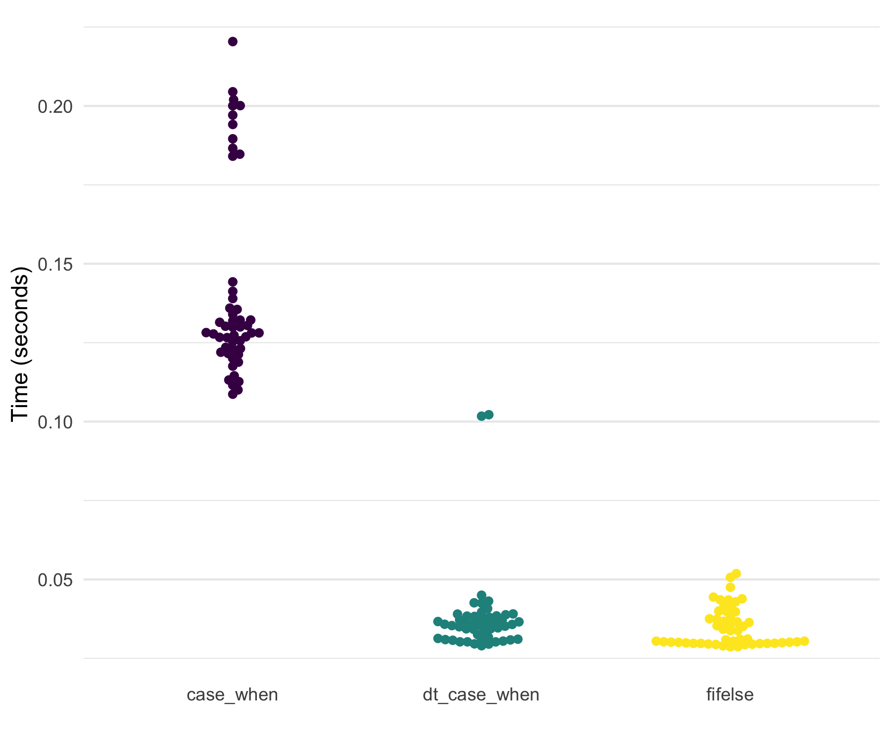
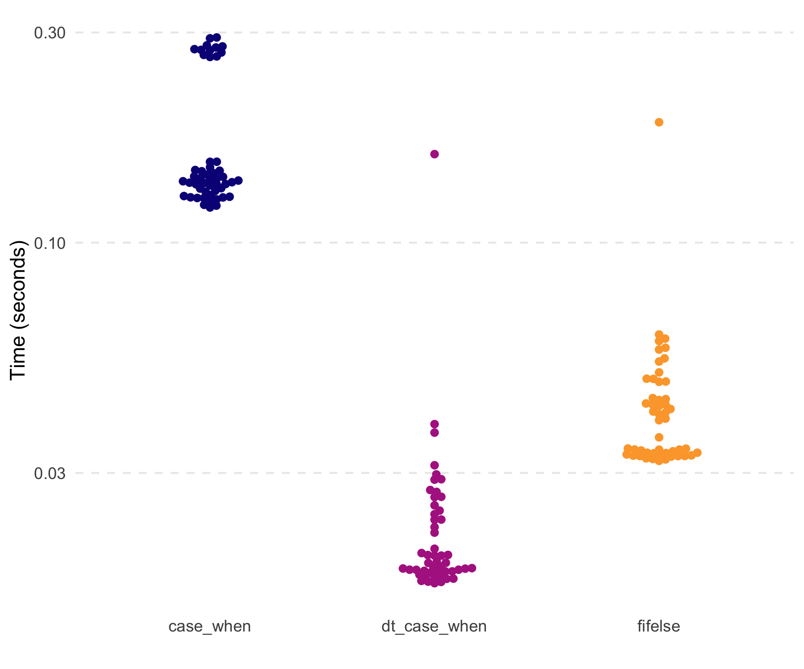
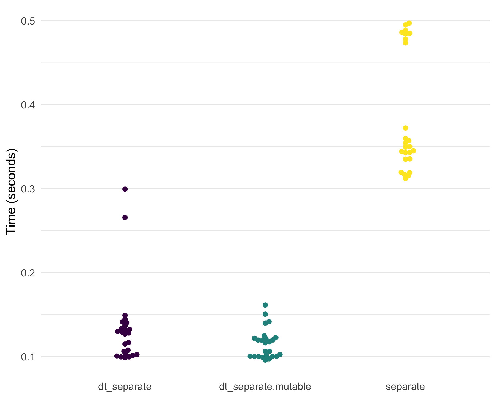
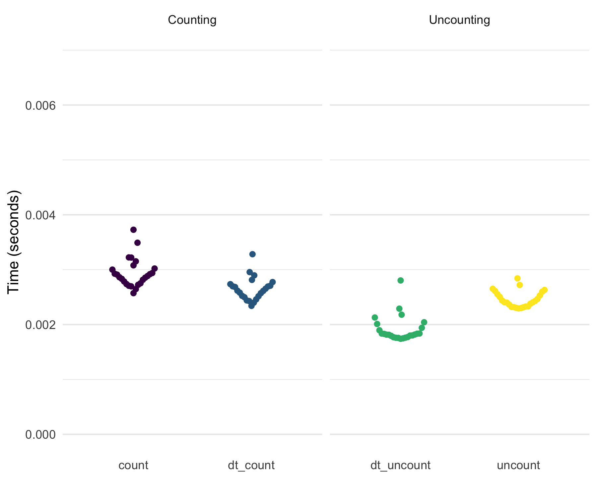

<!-- README.md is generated from README.Rmd. Please edit that file -->

# `tidyfast v0.1.8` 

<!-- badges: start -->

[](https://www.tidyverse.org/lifecycle/#maturing)
[](https://travis-ci.org/TysonStanley/tidyfast)
<!-- badges: end -->

The goal of `tidyfast` is to provide fast and efficient alternatives to
some `tidyr` and `dplyr` functions using `data.table` under the hood.
Each have the prefix of `dt_` to allow for autocomplete in IDEs such as
RStudio. These should compliment some of the current functionality in
`dtplyr` (but notably does not use the `lazy_dt()` framework of
`dtplyr`). This package imports `data.table` and `Rcpp` (no other
dependencies).

These are, in essence, translations from a more `tidyverse` grammar to
`data.table`. Most functions herein are in places where, in my opinion,
the `data.table` syntax is not obvious or clear. As such, these
functions can translate a simple function call into the fast, efficient,
and concise syntax of `data.table`.

The current functions include:

**Nesting and unnesting** (similar to `dplyr::group_nest()` and
`tidyr::unnest()`):

  - `dt_nest()` for nesting data tables
  - `dt_unnest()` for unnesting data tables
  - `dt_hoist()` for unnesting vectors in a list-column in a data table
    (still experimental)

**If Else** (similar to `dplyr::case_when()`):

  - `dt_case_when()` for `dplyr::case_when()` syntax with the speed of
    `data.table::fifelse()`

**Fill** (similar to `tidyr::fill()`)

  - `dt_fill()` for filling `NA` values with values before it, after it,
    or both. This can be done by a grouping variable (e.g. fill in `NA`
    values with values within an individual).

**Count** and **Uncount** (similar to `tidyr::uncount()` and
`dplyr::count()`)

  - `dt_count()` for fast counting by group(s)
  - `dt_uncount()` for creating full data from a count table

**Separate** (similar to `tidyr::separate()`)

  - `dt_separate()` for splitting a single column into multiple based on
    a match within the column (e.g., column with values like “A.B” could
    be split into two columns by using the period as the separator where
    column 1 would have “A” and 2 would have “B”). It is built on
    `data.table::tstrsplit()`. This is not well tested yet and lacks
    some functionality of `tidyr::separate()`.

**Pivoting** (similar to `dplyr::pivot_longer()` and
`dplyr::pivot_wider()`)

  - In development still…

**Adjust `data.table` print options**

  - `dt_print_options()` for adjusting the options for
    `print.data.table()`

*Package is still in active development.*

## Installation

You can install the development version from
[GitHub](https://github.com/) with:

``` r
# install.packages("remotes")
remotes::install_github("TysonStanley/tidyfast")
```

## Examples

The nesting and unnesting functions were shown in a [previous
preprint](https://psyarxiv.com/u8ekc/) while the other functions are
new. Herein, I show some simple applications.

### Nesting and Unnesting

The following data table will be used for the nesting/unnesting
examples.

``` r
library(tidyfast)
library(data.table)
library(dplyr)       # to compare with case_when()
library(tidyr)       # to compare with fill() and separate()

dt <- data.table(
   x = rnorm(1e5),
   y = runif(1e5),
   grp = sample(1L:3L, 1e5, replace = TRUE),
   nested1 = lapply(1:10, sample, 10, replace = TRUE),
   nested2 = lapply(c("thing1", "thing2"), sample, 10, replace = TRUE),
   id = 1:1e5)
```

To make all the comparisons herein more equal, we will set the number of
threads that `data.table` will use to 1.

``` r
setDTthreads(1)
```

We can nest this data using `dt_nest()`:

``` r
nested <- dt_nest(dt, grp)
nested
#>    grp         data
#> 1:   1 <data.table>
#> 2:   2 <data.table>
#> 3:   3 <data.table>
```

We can also unnest this with `dt_unnest()`:

``` r
dt_unnest(nested, col = data, by = grp)
#>         by          x          y         nested1
#>      1:  1  0.1624127 0.11793103 2,3,5,9,1,3,...
#>      2:  1 -0.8749771 0.01200319 6,2,4,8,7,6,...
#>      3:  1 -1.2709261 0.99871440 2,3,5,9,1,3,...
#>      4:  1  0.6252182 0.08392742 4,1,2,5,4,2,...
#>      5:  1 -0.4269078 0.46730652 5,5,4,2,5,2,...
#>     ---                                         
#>  99996:  3 -1.3785841 0.65154073 1,1,1,1,1,1,...
#>  99997:  3  1.7506497 0.35086904 1,3,1,3,1,3,...
#>  99998:  3  1.7920949 0.57767072 2,4,2,2,3,4,...
#>  99999:  3  1.3958509 0.20316446 5,5,4,2,5,2,...
#> 100000:  3  0.4617428 0.64128894 2,8,2,4,6,6,...
#>                                               nested2    id
#>      1: thing2,thing2,thing2,thing2,thing2,thing2,...    10
#>      2: thing2,thing2,thing2,thing2,thing2,thing2,...    18
#>      3: thing2,thing2,thing2,thing2,thing2,thing2,...    20
#>      4: thing1,thing1,thing1,thing1,thing1,thing1,...    25
#>      5: thing1,thing1,thing1,thing1,thing1,thing1,...    27
#>     ---                                                    
#>  99996: thing1,thing1,thing1,thing1,thing1,thing1,... 99991
#>  99997: thing1,thing1,thing1,thing1,thing1,thing1,... 99993
#>  99998: thing2,thing2,thing2,thing2,thing2,thing2,... 99994
#>  99999: thing1,thing1,thing1,thing1,thing1,thing1,... 99997
#> 100000: thing1,thing1,thing1,thing1,thing1,thing1,... 99999
```

When our list columns don’t have data tables (as output from
`dt_nest()`) we can use the `dt_unnest_vec()` function, that will unnest
vectors.

``` r
dt_hoist(dt, 
         nested1, nested2, 
         by = id)
#>              id nested1 nested2
#>       1:      1       1  thing1
#>       2:      1       1  thing1
#>       3:      1       1  thing1
#>       4:      1       1  thing1
#>       5:      1       1  thing1
#>      ---                       
#>  999996: 100000       3  thing2
#>  999997: 100000       5  thing2
#>  999998: 100000       8  thing2
#>  999999: 100000       7  thing2
#> 1000000: 100000       6  thing2
```

### If Else

Also, the new `dt_case_when()` function is built on the very fast
`data.table::fiflese()` but has syntax like unto `dplyr::case_when()`.
That is, it looks like:

``` r
dt_case_when(condition1 ~ label1,
             condition2 ~ label2,
             ...)
```

To show that each method, `dt_case_when()`, `dplyr::case_when()`, and
`data.table::fifelse()` produce the same result, consider the following
example.

``` r
x <- rnorm(1e6)

medianx <- median(x)
x_cat <-
  dt_case_when(x < medianx ~ "low",
               x >= medianx ~ "high",
               is.na(x) ~ "unknown")
x_cat_dplyr <-
  case_when(x < medianx ~ "low",
            x >= medianx ~ "high",
            is.na(x) ~ "unknown")
x_cat_fif <-
  fifelse(x < medianx, "low",
  fifelse(x >= medianx, "high",
  fifelse(is.na(x), "unknown", NA_character_)))

identical(x_cat, x_cat_dplyr)
#> [1] TRUE
identical(x_cat, x_cat_fif)
#> [1] TRUE
```

Notably, `dt_case_when()` is very fast and memory efficient, given it is
built on `data.table::fifelse()`.



    #> # A tibble: 3 x 3
    #>   expression     median mem_alloc
    #>   <chr>        <bch:tm> <bch:byt>
    #> 1 case_when       121ms   148.8MB
    #> 2 dt_case_when     35ms    34.3MB
    #> 3 fifelse        31.4ms    34.3MB

## Fill

A new function is `dt_fill()`, which fulfills the role of
`tidyr::fill()` to fill in `NA` values with values around it (either the
value above, below, or trying both). This currently relies on the
efficient `C++` code from `tidyr` (`fillUp()` and `fillDown()`).

``` r
x = 1:10
dt_with_nas <- data.table(
  x = x,
  y = shift(x, 2L),
  z = shift(x, -2L),
  a = sample(c(rep(NA, 10), x), 10),
  id = sample(1:3, 10, replace = TRUE))

# Original
dt_with_nas
#>      x  y  z  a id
#>  1:  1 NA  3 NA  2
#>  2:  2 NA  4  2  1
#>  3:  3  1  5  7  3
#>  4:  4  2  6  4  3
#>  5:  5  3  7  3  3
#>  6:  6  4  8  5  2
#>  7:  7  5  9  9  1
#>  8:  8  6 10 NA  1
#>  9:  9  7 NA NA  2
#> 10: 10  8 NA NA  3

# All defaults
dt_fill(dt_with_nas, y, z, a)
#>      y  z  a
#>  1: NA  3 NA
#>  2: NA  4  2
#>  3:  1  5  7
#>  4:  2  6  4
#>  5:  3  7  3
#>  6:  4  8  5
#>  7:  5  9  9
#>  8:  6 10  9
#>  9:  7 10  9
#> 10:  8 10  9

# by id variable called `grp`
dt_fill(dt_with_nas, 
        y, z, a, 
        id = list(id))
#>     id  y  z  a
#>  1:  2 NA  3 NA
#>  2:  2  4  8  5
#>  3:  2  7  8  5
#>  4:  1 NA  4  2
#>  5:  1  5  9  9
#>  6:  1  6 10  9
#>  7:  3  1  5  7
#>  8:  3  2  6  4
#>  9:  3  3  7  3
#> 10:  3  8  7  3

# both down and then up filling by group
dt_fill(dt_with_nas, 
        y, z, a, 
        id = list(id), 
        .direction = "downup")
#>     id y  z a
#>  1:  2 4  3 5
#>  2:  2 4  8 5
#>  3:  2 7  8 5
#>  4:  1 5  4 2
#>  5:  1 5  9 9
#>  6:  1 6 10 9
#>  7:  3 1  5 7
#>  8:  3 2  6 4
#>  9:  3 3  7 3
#> 10:  3 8  7 3
```

In its current form, `dt_fill()` is faster than `tidyr::fill()` and uses
slightly less memory. Below are the results of filling in the `NA`s
within each `id` on a 19 MB data set.

``` r
x = 1:1e6
dt3 <- data.table(
  x = x,
  y = shift(x, 10L),
  z = shift(x, -10L),
  a = sample(c(rep(NA, 10), x), 10),
  id = sample(1:3, 10, replace = TRUE))
df3 <- data.frame(dt3)

marks3 <-
  bench::mark(
    tidyr::fill(dplyr::group_by(df3, id), x, y),
    tidyfast::dt_fill(dt3, x, y, id = list(id)),
    check = FALSE,
    iterations = 50
  )
```



    #> # A tibble: 2 x 3
    #>   expression                                    median mem_alloc
    #>   <bch:expr>                                  <bch:tm> <bch:byt>
    #> 1 tidyr::fill(dplyr::group_by(df3, id), x, y)   63.5ms    30.9MB
    #> 2 tidyfast::dt_fill(dt3, x, y, id = list(id))   21.9ms    29.1MB

## Separate

The `dt_separate()` function is still under heavy development. Its
behavior is similar to `tidyr::separate()` but is lacking some
functionality currently. For example, `into` needs to be supplied the
maximum number of possible columns to separate.

``` r
dt_separate(data.table(col = "A.B.C"), col, into = c("A", "B"))
#> Error in `[.data.table`(dt, , eval(split_it)) : 
#>   Supplied 2 columns to be assigned 3 items. Please see NEWS for v1.12.2.
```

For current functionality, consider the following example.

``` r
dt_to_split <- data.table(
  x = paste(letters, LETTERS, sep = ".")
)

dt_separate(dt_to_split, x, into = c("lower", "upper"))
```

    #>    lower upper
    #> 1:     a     A
    #> 2:     b     B
    #> 3:     c     C
    #> 4:     d     D
    #> 5:     e     E
    #> 6:     f     F

Testing with a 4 MB data set with one variable that has columns of “A.B”
repeatedly, shows that `dt_separate()` is fast but less memory efficient
than `tidyr::separate()`.



    #> # A tibble: 3 x 3
    #>   expression            median mem_alloc
    #>   <chr>               <bch:tm> <bch:byt>
    #> 1 separate               351ms    11.6MB
    #> 2 dt_separate            123ms    30.6MB
    #> 3 dt_separate-mutable    116ms    26.7MB

## Count and Uncount

The `dt_count()` function does essentially what `dplyr::count()` does.
Notably, this, unlike the majority of other `dt_` functions, wraps a
very simple statement in `data.table`. That is, `data.table` makes
getting counts very simple and concise. Nonetheless, `dt_count()` fits
the general API of `tidyfast`. To some degree, `dt_uncount()` is also a
fairly simple wrapper, although the approach may not be as
straightforward as that for `dt_count()`.

The following examples show how count and uncount can work. We’ll use
the `dt` data table from the nesting examples.

``` r
counted <- dt_count(dt, grp)
counted
#>    grp     N
#> 1:   1 33330
#> 2:   2 33217
#> 3:   3 33453
```

``` r
uncounted <- dt_uncount(counted, N)
print(uncounted)
#>         grp
#>      1:   1
#>      2:   1
#>      3:   1
#>      4:   1
#>      5:   1
#>     ---    
#>  99996:   3
#>  99997:   3
#>  99998:   3
#>  99999:   3
#> 100000:   3
```

These are also quick (not that the `tidyverse` functions were at all
slow here).

``` r
dt5 <- copy(dt)
df5 <- data.frame(dt5)

marks5 <-
  bench::mark(
    counted_tbl <- dplyr::count(df5, grp),
    counted_dt <- tidyfast::dt_count(dt5, grp),
    tidyr::uncount(counted_tbl, n),
    tidyfast::dt_uncount(counted_dt, N),
    check = FALSE,
    iterations = 25
  )
```



*Other functions are currently in progress.*

## Note

Please note that the `tidyfast` project is released with a [Contributor
Code of Conduct](.github/CODE_OF_CONDUCT.md). By contributing to this
project, you agree to abide by its terms.

Also, `ggplot2`, `stringr`, and `ggbeeswarm` were used herein for
creating plots.
